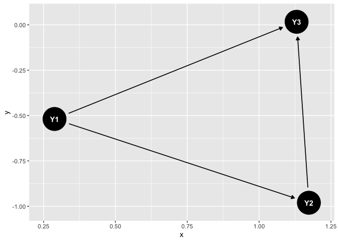

# AdjCausDisc

AdjCausDisc is a package that uses inputed Y data and a specific
Adjacency matrix, that provides the structure of a Directed Acyclic
graph, to provide the value of the coefficients for each of the connects
between the different entries of Y using either the spike and slab prior
or the SSVS bayesian variable selection technique.

The Adjacency matrix will be a matrix of entries of 1s and 0s that is
lower diagonals that shows the connections between the input Y
variables. Where the entry ij in the matrix represents the connection
from *Y*<sub>*j*</sub> to *Y*<sub>*i*</sub>, which will be 1 if there is
a connection or 0 if there is no connection. Since AdjCausDisc will
focus on DAGs where there is no cyclic relationship between the Y data
entries, so the matrix will have to be lower diagonal.

As an example, consider we have data Y = (Y1, Y2, Y3) and the Adjacency
matrix below:

$$
\begin{bmatrix} 
    0 & 0 & 0 \\
    1 & 0 & 0\\
    1 & 1 & 0 \\
    \end{bmatrix}
$$

As mentioned above each entry ij represents connection between
*Y*<sub>*j*</sub> to *Y*<sub>*i*</sub>, so the adjacency matrix shows
there relationship from *Y*<sub>1</sub> to *Y*<sub>2</sub>,
*Y*<sub>1</sub> to *Y*<sub>3</sub>, and *Y*<sub>2</sub> to
*Y*<sub>3</sub>.

If there is a 1 at entry at row 1 column 2, then there has to be a
connection between *Y*<sub>2</sub> to *Y*<sub>1</sub>, but we have a
connection between *Y*<sub>1</sub> to *Y*<sub>2</sub>, which would make
the DAG cyclic. Therefore, we make sure that the Adjacency matrix is
lower triangular.

As mentioned, though the goal of some of the packages is to find the
corresponding the coefficients corresponding to the edges that are
connected in the DAG, which can be solved in the matrix
*B*<sub>*ij*</sub> in the model

*Y*<sub>*i*</sub> = ∑<sub>*j* ∈ *pa*(*j*)</sub>*B*<sub>*ij*</sub>*Y*<sub>*j*</sub> + *ϵ*<sub>*i*</sub>

where pa(j) represents the parent nodes of *Y*<sub>*j*</sub>. In order
to get the corresponding matrix with all the *B*<sub>*i**j*</sub>’s is
to use either the

\*CoefMat_Create_Spike_Slab: Assigns the spike and slab prior to
*B*<sub>*ij*</sub> and performs sampling to get the values of the
individuals coefficients.

\*CoefMat_Create_SSVS: Using stochastic search variable selection to get
the *B*<sub>*ij*</sub>s and performs sampling to get the values of the
individuals coefficients.

\*AdjDAG: Uses the structure provided in the adjacency matrix, to create
the visualization of the Directed Acyclic Graph.

``` r
library(AdjCausDisc)
Y<-rnorm(3)

# Adjacency Matrix that shows relationships between each of the variables for Y = (Y1, Y2, Y3)

Adjacency_matrix = matrix(nrow=3,ncol=3,0)
Adjacency_matrix[,1]=c(0,1,1)
Adjacency_matrix[,2]=c(0,0,1)
Adjacency_matrix[,3]=c(0,0,0)

# Spike and Slab example
Spike_Slab_results = CoefMat_Create_Spike_Slab(Y,Adjacency_matrix)
```

    ## Warning in randomForest.default(cbind(X.wrk), Y.center, ntree = ntree,
    ## importance = TRUE): The response has five or fewer unique values.  Are you sure
    ## you want to do regression?

``` r
# SSVS example
SSVS_results = CoefMat_Create_SSVS(Y, Adjacency_matrix)
```

``` r
Spike_Slab_results
```

    ##             [,1]        [,2] [,3]
    ## [1,]  0.00000000  0.00000000    0
    ## [2,]  0.06291464  0.00000000    0
    ## [3,] -0.09707375 -0.07412243    0

``` r
SSVS_results
```

    ##         [,1]    [,2] [,3]
    ## [1,]  0.0000  0.0000    0
    ## [2,]  0.2655  0.0000    0
    ## [3,] -0.1916 -0.1942    0

``` r
AdjDAG(Adjacency_matrix)
```


